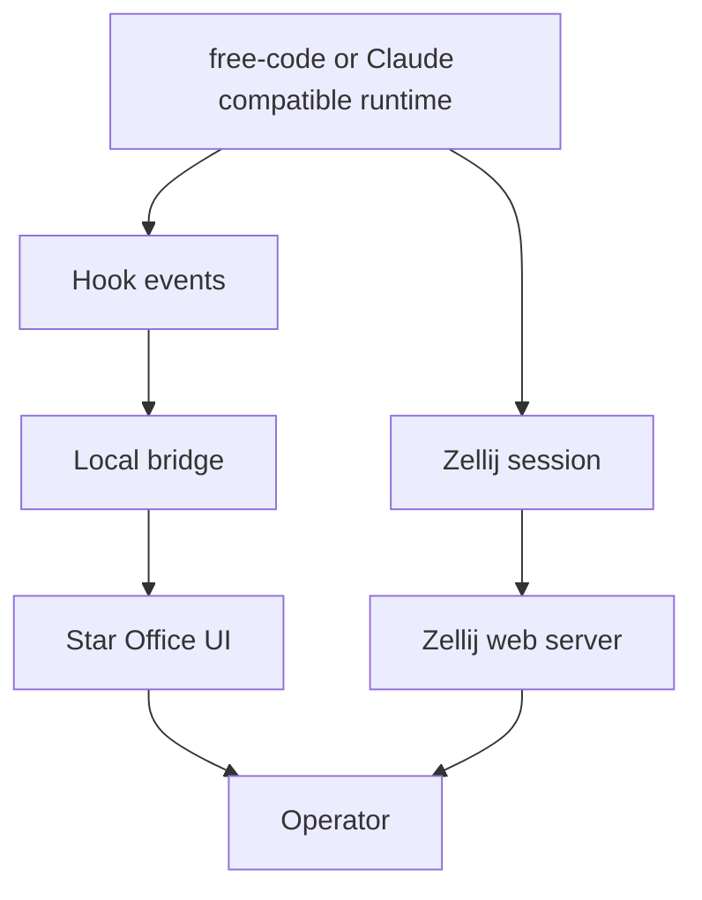

# Architecture

## TL;DR

- Keep the execution plane, dashboard plane, and terminal plane separate.
- Claude or free-code compatible hooks feed a local bridge.
- The bridge owns normalization and forwarding.
- Star Office UI shows summarized state.
- Zellij remains the real session host and remote terminal surface.

## System Shape

## Repo Roles

- `src/index.ts`
  Runs the local bridge HTTP server.

- `src/stateMapper.ts`
  Converts hook events into stable office states.

- `src/starOfficeClient.ts`
  Talks to the current Star Office UI HTTP API.

- `src/sessionRegistry.ts`
  Maintains in-memory session and agent state for observability.

- `plugins/claude-star-office-bridge/`
  Draft plugin that forwards hook payloads to the bridge.

- `scripts/launch-zellij-lab.sh`
  Starts or attaches the operator session in Zellij.

## Why This Boundary

### Claude or free-code side

Best source of truth for:

- tool lifecycle
- subagent lifecycle
- permission requests
- task completion

### Star Office UI side

Best source of truth for:

- visual office rendering
- multi-agent presence board
- lightweight browser or phone glanceability

### Zellij side

Best source of truth for:

- terminal state
- pane layout
- long-lived session identity
- browser and phone terminal access

## Current Event Mapping

| Input | Office state |
| --- | --- |
| `PreToolUse` for `WebSearch`, `WebFetch`, `Read`, `Glob`, `Grep` | `researching` |
| `PreToolUse` for `Edit`, `Write`, `MultiEdit` | `writing` |
| `PreToolUse` for `Bash`, `Run`, `Task` | `executing` |
| `PostToolUseFailure`, `PermissionDenied`, `StopFailure` | `error` |
| `TaskCompleted`, `Stop`, `SubagentStop` | `idle` |

The mapping is intentionally small because Star Office UI's current rendered state model is small.
